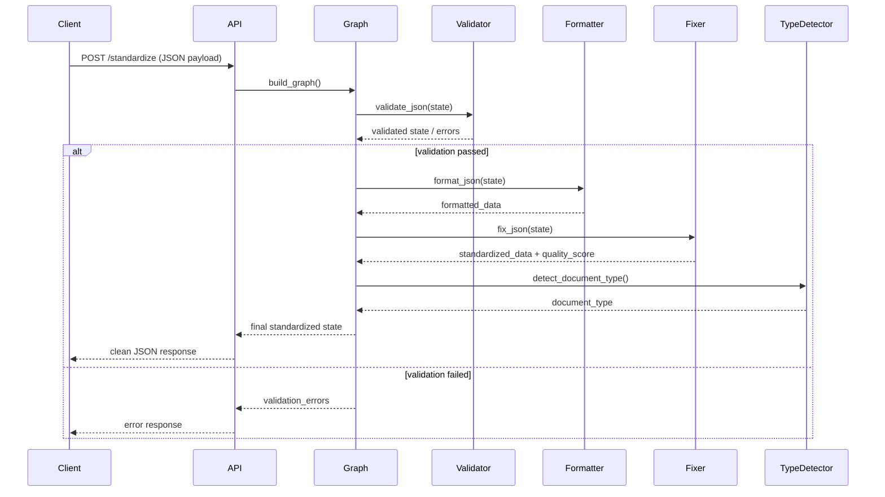

# UML Sequence Diagram

```mermaid
sequenceDiagram
    participant Client
    participant API
    participant Graph
    participant Validator
    participant Formatter
    participant Fixer
    participant TypeDetector

    Client->>API: POST /standardize (JSON payload)
    API->>Graph: build_graph()

    Graph->>Validator: validate_json(state)
    Validator-->>Graph: validated state / errors

    alt validation passed
        Graph->>Formatter: format_json(state)
        Formatter-->>Graph: formatted_data

        Graph->>Fixer: fix_json(state)
        Fixer-->>Graph: standardized_data + quality_score

        Graph->>TypeDetector: detect_document_type()
        TypeDetector-->>Graph: document_type

        Graph-->>API: final standardized state
        API-->>Client: clean JSON response

    else validation failed
        Graph-->>API: validation_errors
        API-->>Client: error response
    end
```