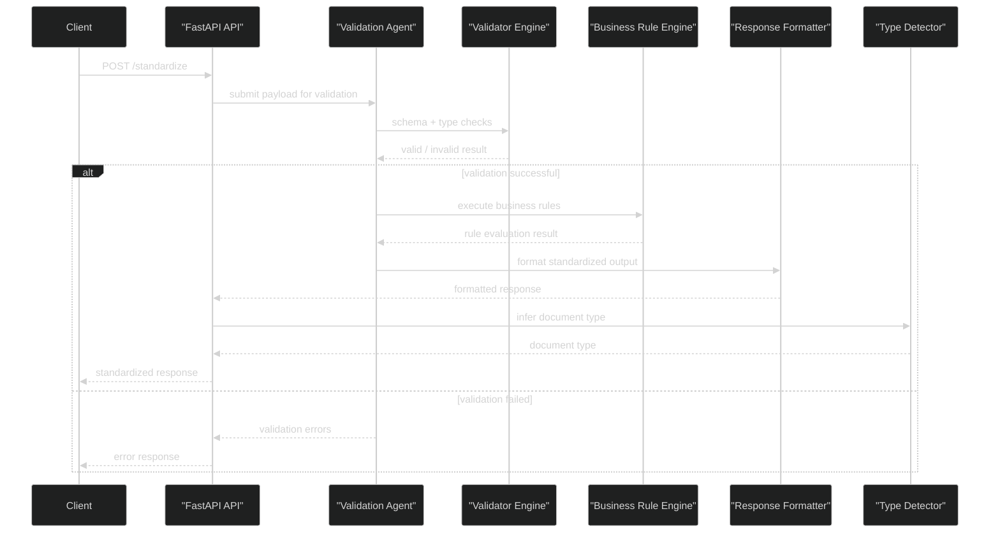

# UML Sequence Diagram

```mermaid
%%{init: {'theme':'dark'}}%%
sequenceDiagram
    participant Client
    participant FastAPI as "FastAPI API"
    participant ValidationAgent as "Validation Agent"
    participant ValidatorEngine as "Validator Engine"
    participant BusinessRuleEngine as "Business Rule Engine"
    participant ResponseFormatter as "Response Formatter"
    participant TypeDetector as "Type Detector"

    Client->>FastAPI: POST /standardize
    FastAPI->>ValidationAgent: submit payload for validation
    ValidationAgent->>ValidatorEngine: schema + type checks
    ValidatorEngine-->>ValidationAgent: valid / invalid result

    alt validation successful
        ValidationAgent->>BusinessRuleEngine: execute business rules
        BusinessRuleEngine-->>ValidationAgent: rule evaluation result
        ValidationAgent->>ResponseFormatter: format standardized output
        ResponseFormatter-->>FastAPI: formatted response
        FastAPI->>TypeDetector: infer document type
        TypeDetector-->>FastAPI: document type
        FastAPI-->>Client: standardized response
    else validation failed
        ValidationAgent-->>FastAPI: validation errors
        FastAPI-->>Client: error response
    end
```