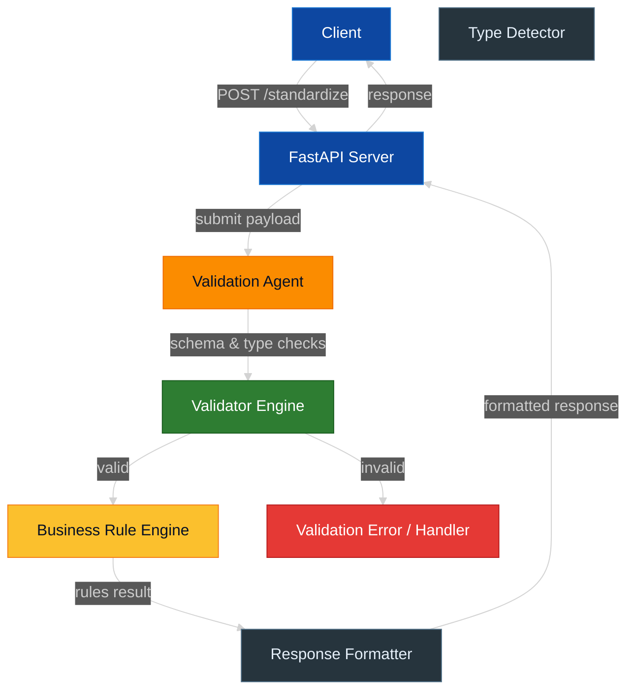

# Workflow Flowchart

This flowchart is derived from the sequence diagram and shows the main validation workflow.

```mermaid
%%{init: {'theme':'dark'}}%%
flowchart TD
  %% Nodes
  Client[Client]:::blue
  FastAPI[FastAPI Server]:::blue
  ValidationAgent[Validation Agent]:::orange
  ValidatorEngine[Validator Engine]:::green
  BusinessRules[Business Rule Engine]:::yellow
  Formatter[Response Formatter]:::neutral
  TypeDetector[Type Detector]:::neutral
  Error[Validation Error / Handler]:::red

  %% Flow
  Client -->|POST /standardize| FastAPI
  FastAPI -->|submit payload| ValidationAgent
  ValidationAgent -->|schema & type checks| ValidatorEngine
  ValidatorEngine -->|valid| BusinessRules
  ValidatorEngine -->|invalid| Error
  BusinessRules -->|rules result| Formatter
  Formatter -->|formatted response| FastAPI
  FastAPI -->|response| Client

  %% Styling
  classDef blue fill:#0D47A1,stroke:#1976D2,stroke-width:1px,color:#ffffff;
  classDef orange fill:#FB8C00,stroke:#EF6C00,stroke-width:1px,color:#071024;
  classDef green fill:#2E7D32,stroke:#1B5E20,stroke-width:1px,color:#ffffff;
  classDef yellow fill:#FBC02D,stroke:#F57F17,stroke-width:1px,color:#071024;
  classDef red fill:#E53935,stroke:#B71C1C,stroke-width:1px,color:#ffffff;
  classDef neutral fill:#26343D,stroke:#4F6E85,stroke-width:1px,color:#E6F0FA;
```
